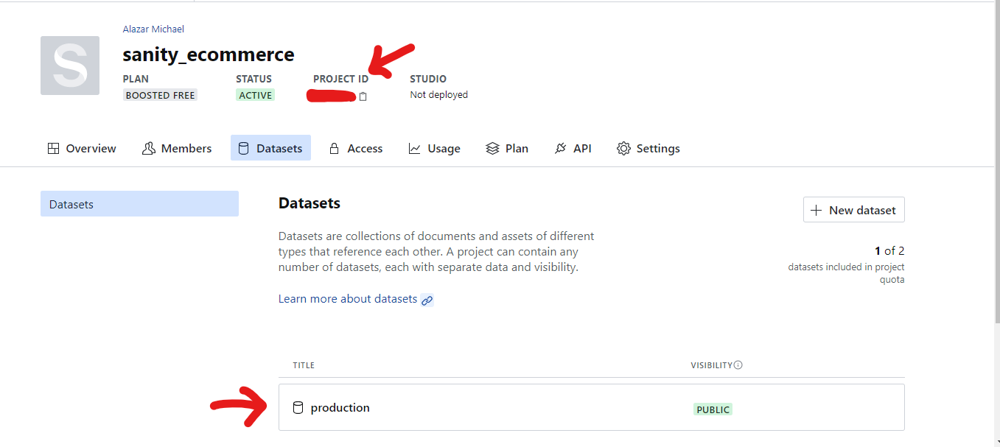

## Connecting to Sanity

- Create a folder called `lib` in the root folder on the same level as `pages`, `publics ` and so on.
- In the `lib` folder create a file called `client.js`
- Inside `client.js`,

```
import sanityClient from "@sanity/client";
import imageUrlBuilder from "@sanity/image-url";

export const client = sanityClient({
  projectId: "YourProjectId",
  dataset: 'production',
  apiVersion: "2022-10-22",
  useCdn: true,
token: process.env.SANITY_API_TOKEN,
});

const builder = imageUrlBuilder(client);
export const urlFor = (source) => builder.image(source);

```



- You can see project ID and dataset in the image above, for `apiVersion` (YYYY MM DD)you can give it the day you are on, and sanity will automatically give you an api that is active at that date.

!!!success
What does the apiVersion date mean?  
Essentially, the date you enter for the apiVersion will use the API as it worked on that date. You can confidently use features that were added on or before that date, and any breaking changes implemented after that date will not affect your use of the API.
the Sanity API is versioned based on ISO dates (YYYY-MM-DD) in the UTC timezone.
!!!

- Create token by going to `API` -> `Tokens` -> `Add API Token` -> give it a name -> select `editor` from the permissions -> `Save`, This will generate an API token.
- at the root of our app create a `.env` file and create a variable (mine is `SANITY_API_TOKEN`) and paste in the API token you copied.
  That's it for setting up our client.

- Inside main `index.js` import the client.

```

import {client} from '../lib/client'
```

- At the bottom of our file (`index.js`) before our export

```
export const getServerSideProps = async () => {
  // grab everything form our sanity dashboard
  const query = '*[_type == "product"]';
  const products = await client.fetch(query);
  const bannerQuery = '*[_type == "banner"]';
  const bannerData = await client.fetch(bannerQuery);
  return {
    props: {products, bannerData}
  }
};
```

- And inside your `div` where you display your products. . .

```

<div className="products-container">
  {products?.map((product) => product.name)}
</div>
```

## Hero banner

- Inside `index.js`.

```
<HeroBanner heroBanner = {bannerData.length && bannerData[0]}/>
```

- Now take the passed prop inside `HeroBanner`.
- Add data in your `banner` schema on the sanity manage page.
- Our HeroBanner should be

```
import React from "react";
import Link from "next/Link";
import { urlFor } from "../lib/client"

const HeroBanner = ({heroBanner}) => {
  return (
    <div className="hero-banner-container">
      <div>
        <p className="beats-solo">{heroBanner.smallText}</p>
        <h3>{heroBanner.midText}</h3>
        <h1>{heroBanner.largeText1}</h1>
        
        <div>
          <Link href={`/product/${heroBanner.product}`}>
            <button type="button"> {heroBanner.buttonText}</button>
          </Link>
          <div className="desc">
            <h5> Description</h5>
            <p>{heroBanner.desc}</p>
          </div>
        </div>
      </div>
    </div>
  );
};

export default HeroBanner;

```

- Now you should end up with
  
