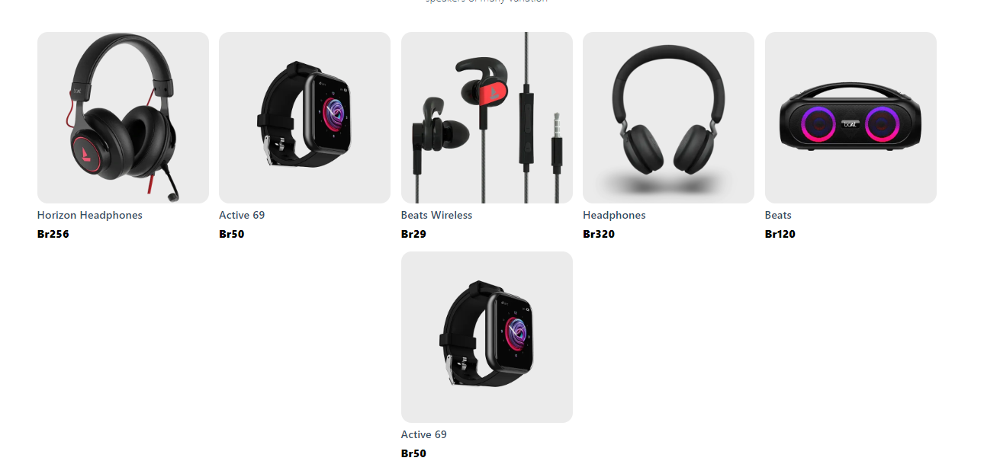
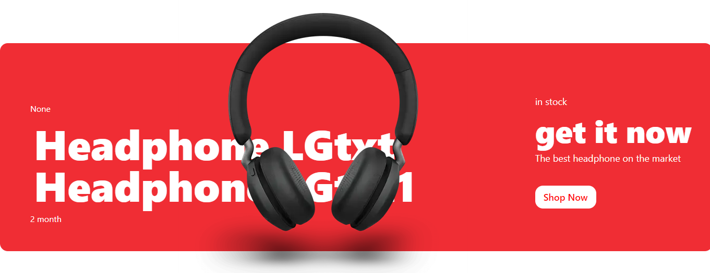

- Modify our product component but before that, lets modify how it is rendered in the `index.js`

```
<div className="products-container">
        {products?.map((product) => (
          <Product key={product._id} product={product} />
        ))}
      </div>
```

- Add a few more entries of data to your product schema to populate our page.

- Now we will finish up our products page.

```
import React from "react";
import Link from "next/Link";
import { urlFor } from "../lib/client";

const Product = ({ product: { image, name, slug, price } }) => {
  return (
    <div>
      <Link href={`/product/${slug.current}`}>
        <div className="product-card">
          
          <p className="product-name">{name}</p>
          <p className="product-price">Br{price}</p>
        </div>
      </Link>
    </div>
  );
};

export default Product;

```



## Footer banner

- modify our footer component inside `index.js`

```
<FooterBanner FooterBanner={bannerData && bannerData[0]}/>
```

- Now inside `FooterBanner.jsx`, take the props that were sent, spread them and render them as needed.

```
import React from "react";
import Link from "next/Link";
import { urlFor } from "../lib/client";

const FooterBanner = ({ footerBanner: { discount, largeText1, largeText2, saleTime, smallText, midText, product, desc, buttonText, image} }) => {
  return (
    <div className="footer-banner-container">
      <div className="banner-desc">
        <div className="left">
          <p>{discount}</p>
          <h3>{largeText1}</h3>
          <h3>{largeText2}</h3>
          <p>{saleTime}</p>
        </div>
        <div className="right">
          <p>{smallText}</p>
          <h3>{midText}</h3>
          <p>{desc}</p>
          <Link href={`products/${product}`}>
            <button type="button">{buttonText}</button>
          </Link>
          

        </div>
      </div>
    </div>
  );
};

export default FooterBanner;

```



## Fixing our layout

- If you notice, we still don't have a navbar, and our banners are going all the way to the right and left edges of the screen, time to fix that.
- Inside our `Layout.jsx`,

```
import React from "react";
import Head from "next/head";
import Footer from "./Footer";
import Navbar from "./Navbar";

const Layout = ({children}) => {
  return (
    <div className="layout">
      <Head>
        <title>Alpha store</title>
      </Head>
      <header>
        <Navbar />
      </header>
      <main className="main-container">{children}</main>
      <footer>
        <Footer />
      </footer>
    </div>
  );
};

export default Layout;


```

- So far you might run in to "children not found" or something like that, to fix that go to `_app.js` inside `pages`, wrap your `Component` with `Layout`.
  !!!warning
  the `Component` inside `_app.js` is whatever component is displayed at that time.
  !!!

```
import React from "react";
import "../styles/globals.css";
import { Layout } from "../components";

function MyApp({ Component, pageProps }) {
  return (
    <Layout>
      <Component {...pageProps} />;
    </Layout>
  );
}

export default MyApp;

```

## Setup Navbar

- Inside `Navbar.jsx`

```
import React from "react";
import Link from "next/Link";
import { AiOutlineShopping } from "react-icons/ai";

const Navbar = () => {
  return (
    <div className="navbar-container">
      <p className="logo">
        <Link href="/">Alpha Electronics</Link>
      </p>
      <button type="button" className="cart-icon" onClick="">
        <AiOutlineShopping/>
        ## Leaving hard coded number cause we will change it later
        <span className="cart-item-qty">50</span>
      </button>
    </div>
  );
};

export default Navbar;

```

## Setting up Footer

- Inside `Footer.jsx`

```
import React from 'react'
import {AiFillInstagram, AiOutlineTwitter} from "react-icons/ai"

const Footer = () => {
  const year = new Date().getFullYear();
  return (
    <div className="footer-container">
      <p>© {year} Alpha Electronics All rights reserved.</p>
      <p className="icons">
        <AiFillInstagram/>
        <AiOutlineTwitter/>
      </p>
    </div>
  );
}

export default Footer
```
