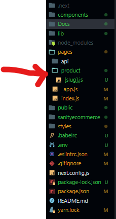

- Go to pages and create a folder called `product` inside this folder create a file called `[slug].js`
  !!!
  `[file_name].js` means the file will be dynamic.
  !!!

- Inside `[slug].js`.
```
import React, { useState } from "react";
import { client, urlFor } from "../../lib/client";
import {
  AiOutlineMinus,
  AiOutlinePlus,
  AiFillStar,
  AiOutlineStar,
} from "react-icons/ai";
import { Product } from "../../components";

const ProductDetails = ({ product, products }) => {
  const { image, name, details, price } = product;
  const [index, setIndex] = useState(0);
  return (
    <div>
      <div className="product-detail-container">
        <div>
          <div className="image-container">
            
          </div>
          <div className="small-images-container">
            {image?.map((item, i) => (
               setIndex(i)}
                alt="product image"
              />
            ))}
          </div>
        </div>
        <div className="product-detail-desc">
          <h1>{name}</h1>
          <div className="reviews">
            {/* Our review stars */}
            <div>
              <AiFillStar />
              <AiFillStar />
              <AiFillStar />
              <AiFillStar />
              <AiOutlineStar />
            </div>
            <p>(20)</p>
          </div>
        </div>
        <h4 className="details"> Details: </h4>
        <p>{details}</p>
        <p className="price">Br.{price}</p>
        <div className="quantity">
          <h3>Quantity: </h3>
          <p className="quantity-desc">
            <span className="minus" onClick="">
              <AiOutlineMinus />
            </span>
            <span className="num">3</span>
            <span className="plus" onClick="">
              <AiOutlinePlus />
            </span>
          </p>
        </div>
        <div className="buttons">
          <button type="button" className="add-to-cart" onClick="">
            {" "}
            Add to Cart{" "}
          </button>
          <button type="button" className="buy-now" onClick="">
            {" "}
            Buy now{" "}
          </button>
        </div>
      </div>
      <div className="maylike-products-wrapper">
        <h2> You may also like</h2>
        <div className="marquee">
          <div className="maylike-products-container track">
            {products.map((item) => (
              <Product key={item._id} product={item} />
            ))}
          </div>
        </div>
      </div>
    </div>
  );
};
export const getStaticPaths = async () => {
  // get all the product but return only the current slug property
  const query = `*[_type == "product"]{
    slug{
      current
    }
  }`;
  const products = await client.fetch(query);
  const paths = products.map((product) => ({
    params: {
      slug: product.slug.current,
    },
  }));
  return {
    paths,
    fallback: "blocking",
  };
};
export const getStaticProps = async ({ params: { slug } }) => {
  const query = `*[_type == "product" && slug.current=='${slug}'][0]`;
  const productsQuery = '*[_type == "product"]';
  const product = await client.fetch(query);
  const products = await client.fetch(productsQuery);
  const bannerQuery = '*[_type == "banner"]';
  const bannerData = await client.fetch(bannerQuery);
  return {
    props: { products, product },
  };
};

export default ProductDetails;

```