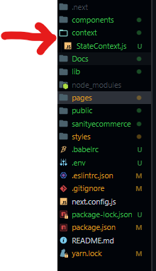

- On the root folder create a folder `context`
- Inside this folder create a file `StateContext.js`.
- Inside `StateContext.s` build the basic context.

```
import React, { createContext, useContext, useState, useEffect } from "react";
import { toast } from "react-hot-toast";
const Context = createContext();
export const StateContext = ({ children }) => {
  const [showCart, setShowCart] = useState(false);
  const [cartItems, setCartItems] = useState([]);
  const [totalPrice, setTotalPrice] = useState(0);
  const [totalQuantities, setTotalQuantities] = useState();
  const [qty, setQty] = useState(1);
  return (
    <Context.Provider
      value={{
         setCartItems,
        setTotalPrice,
        setTotalQuantities,
        showCart,
        cartItems,
        totalPrice,
        totalQuantities,
        qty,
      }}
    >
      {children}
    </Context.Provider>
  );
};

```

- Wrap our components with the context (inside `_app.js`)

```
import React from "react";
import "../styles/globals.css";
import { Layout } from "../components";
import { StateContext } from "../context/StateContext";
import { Toaster } from "react-hot-toast";
function MyApp({ Component, pageProps }) {
  return (
    <StateContext>
      <Layout>
        <Toaster/>
        <Component {...pageProps} />
      </Layout>
    </StateContext>
  );
}

export default MyApp;

```



## Adding functionalities

### Product details page

- Just below our states definition

```
//   Increase Quantity in products detail of the item being purchased
  const incQty = () => {
    setQty((prevQty) => prevQty + 1);
  };
  //   Decrease Quantity in products detail of the item being purchased
  const decQty = () => {
    setQty((prevQty) => {
      if (prevQty - 1 < 1) return 1;
      return prevQty - 1;
    });
  };
```

- And the values we return inside our context provider, add these functions.

```
 incQty,
 decQty,
```

- Export our context.

```
export const useStateContext = () => useContext(Context);

```

- Import our context inside `[slug].js`

```
import {useStateContext} from "../../context/StateContext"
```

- Destructure the values we want to use (just below our state [still inside `[slug].js`])

```
const {decQty, incQty, qty} = useStateContext()
```

- Add our functions to their appropriate place `decQty` to decrease the quantity and `incQty` to increase quantity and `qty` to display quantity.

```
<p className="quantity-desc">
    <span className="minus" onClick={decQty}>
        <AiOutlineMinus />
    </span>
    <span className="num">{qty}</span>
    <span className="plus" onClick={incQty}>
        <AiOutlinePlus />
    </span>
```

### Adding to cart

- Just above the definition of `decQty` and `incQty`, define a function that will handle manipulation of the cart.

```

  const onAdd = (product, quantity) => {
    const checkProductInCart = cartItem.find((item) => item.id === product._id);
    setTotalPrice(
      (prevTotalPrice) => prevTotalPrice + product.price * quantity
    );
    setTotalQuantities((PrevTotalQuantity) => PrevTotalQuantity + quantity);
    if (checkProductInCart) {
      //   If we are adding more quantities of the same product that's already
      //   inside our, we need to recognize that it is already in there and just
      //   add it's quantity, not add more items of the same product
      const updateCartItems = cartItems.map((cartProduct) => {
        if (cartProduct._id === product._id)
          return {
            ...cartProduct,
            quantity: cartProduct.quantity + quantity,
          };
      });
      setCartItems(updatedCartItems);
    } else {
      product.quantity = quantity;
      setCartItems([...cartItems, { ...product }]);
    }
    toast.success(`${qty} ${product.name} added to cart`);
  };
```

- Pass your function through the context provider along with `decQty` and others.

```
onAdd,
```

- Update our spread values we get from our context.

```
const {decQty, incQty, qty, onAdd} = useStateContext()
```

- Update our `Add to Cart` button.

```
<button type="button" className="add-to-cart" onClick={()=> onAdd(product, qty)}>
    Add to Cart
</button>
```

## Cart functionalities

- Head to our navbar component.
- Import and render our `Cart` component.

```
import React from "react";
import Link from "next/Link";
import { AiOutlineShopping } from "react-icons/ai";
import {Cart} from "./"

const Navbar = () => {
  return (
    <div className="navbar-container">
      <p className="logo">
        <Link href="/">Alpha Electronics</Link>
      </p>
      <button type="button" className="cart-icon" onClick="">
        <AiOutlineShopping/>
        <span className="cart-item-qty">5</span>
      </button>
      <Cart/>
    </div>
  );
};

export default Navbar;

```

- Modify our values we are sending out to include setShowCart inside our context provider.

```
setShowCart,
```

- Modify our `Navbar` component.

```
.
.
.
import { Cart } from "./";
import { useStateContext } from "../context/StateContext";

const Navbar = () => {
  const { showCart, setShowCart, totalQuantities } = useStateContext();
  return (
    <div className="navbar-container">
      <p className="logo">
        <Link href="/">Alpha Electronics</Link>
      </p>
      <button
        type="button"
        className="cart-icon"
        onClick={() => setShowCart(true)}
      >
        <AiOutlineShopping />
        <span className="cart-item-qty">{totalQuantities}</span>
      </button>
      {showCart &&  <Cart />}
    </div>
  );
};

export default Navbar;

```

### Cart component

- Inside the `Cart` component, include the next block of code.

```
import React, { useRef } from "react";
import Link from "next/link";
import {
  AiOutlineMinus,
  AiOutlinePlus,
  AiOutlineLeft,
  AiOutlineShopping,
} from "react-icons/ai";
import { TiDeleteOutline } from "react-icons/ti";
import toast from "react-hot-toast";
import { useStateContext } from "../context/StateContext";
import { urlFor } from "../lib/client";

const Cart = () => {
  const cartRef = useRef();
  const {
    totalPrice,
    totalQuantities,
    cartItems,
    setShowCart,
    decQty,
    incQty,
    qty,
  } = useStateContext();
  return (
    <div className="cart-wrapper" ref={cartRef}>
      <div className="cart-container">
        <button
          className="cart-heading"
          type="button"
          onClick={() => setShowCart(false)}
        >
          <AiOutlineLeft />
          <span className="heading">Your Cart</span>
          <span className="cart-num-items">({totalQuantities})</span>
        </button>
        {cartItems.length < 1 && (
          <div className="empty-cart">
            <AiOutlineShopping size={150} />
            <h3>Your Shopping Bag is Empty </h3>
            <Link href="/">
              <button
                type="button"
                onClick={() => setShowCart(false)}
                className="btn"
              >
                Continue Shopping
              </button>
            </Link>
          </div>
        )}
        <div className="product-container">
          {cartItems.length >= 1 &&
            cartItems.map((item, index) => (
              <div className="product" key={item._id}>
                
                <div className="item-desc">
                  <div className="flex-top">
                    <h4>{item.name} </h4>
                    <h5>Br.{item.price} </h5>
                  </div>
                  <div className="flex bottom">
                    <div>
                      <p className="quantity-desc">
                        <span className="minus" onClick="">
                          <AiOutlineMinus />
                        </span>
                        <span className="num">0</span>
                        <span className="plus" onClick="">
                          <AiOutlinePlus />
                        </span>
                      </p>
                    </div>
                    <button type="button" className="remove-item" onClick="">
                      <TiDeleteOutline />
                    </button>
                  </div>
                </div>
              </div>
            ))}
        </div>
        {cartItems.length >= 1 && (
          <div className="cart-bottom">
            <div className="total">
              <h3>Subtotal: </h3>
              <h3>Br. {totalPrice}</h3>
            </div>
            <div className="btn-container">
              <button type="button" className="btn" onClick="">Pay with Stripe </button>
            </div>
          </div>
        )}
      </div>
    </div>
  );
};

export default Cart;

```

- Now to implement the `+` `-` icons inside our cart, get to the `StateContext`, above `incQty`

```
const toggleCartItemQuantity = (id, value) => {
    foundProduct = cartItems.find((item) => item._id === id);
    index = cartItems.findIndex((product) => product._id === id);
    const newCartItems = cartItems.filter((item) => item._id !== id)
    if (value === "inc") {
      setCartItems([
        ...newCartItems,
        { ...foundProduct, quantity: foundProduct.quantity + 1 },

      ]);
      setTotalPrice((prevTotalPrice) => prevTotalPrice + foundProduct.price);
      setTotalQuantities((prevTotalQuantities) => prevTotalQuantities + 1);
    } else if (value === "dec") {
      if (foundProduct.quantity > 1) {
        setCartItems([
          ...newCartItems,
          { ...foundProduct, quantity: foundProduct.quantity - 1 },
        ]);
        setTotalPrice((prevTotalPrice) => prevTotalPrice - foundProduct.price);
        setTotalQuantities((prevTotalQuantities) => prevTotalQuantities - 1);
      }
    }
  };
```

- Modify our values we are sending out to include setShowCart inside our context provider.

```
toggleCartItemQuantity
```

- Modify our buttons inside `Cart`, where we define the `+` and `-` buttons

```
<p className="quantity-desc">
  <span
    className="minus"
    onClick={() => toggleCartItemQuantity(item._id, "dec")}>
    <AiOutlineMinus />
  </span>
  <span className="num">{item.quantity}</span>
  <span className="plus" onClick={() => toggleCartItemQuantity(item._id, "inc")}>
    <AiOutlinePlus />
  </span>
</p>
```

### Remove items from cart

- Above `totalCartItemQuantity` function in our `StateContext`, define a function to remove items

```
// Remove items from the cart
   const onRemove = (product) => {
    foundProduct = cartItems.find((item) => item._id === product._id);
    const newCartItems = cartItems.filter((item) => item._id !== product._id);
    setTotalPrice(
      (prevTotalPrice) =>
        prevTotalPrice - foundProduct.price * foundProduct.quantity
    );
    setTotalQuantities(
      (prevTotalQuantities) => prevTotalQuantities - foundProduct.quantity
    );
    setCartItems(newCartItems);
  };
```

- Send out the new function from our context provider

```
onRemove,
```

- Modify our delete button

```
<button type="button" className="remove-item" onClick={() => onRemove(item) }>
  <TiDeleteOutline />
</button>
```
