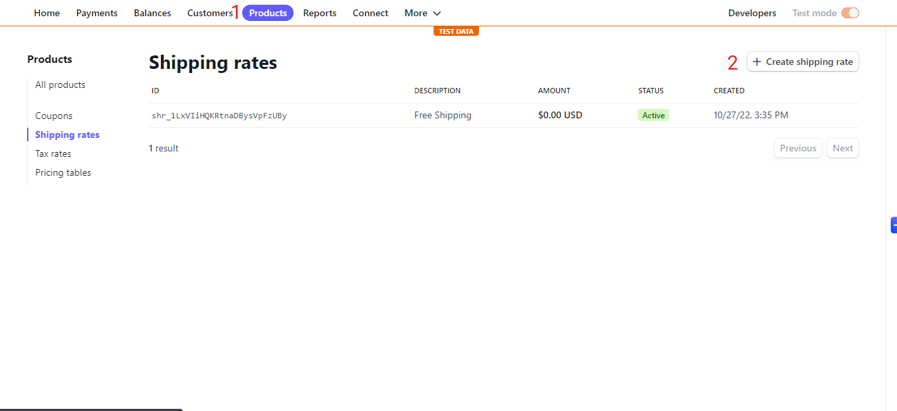
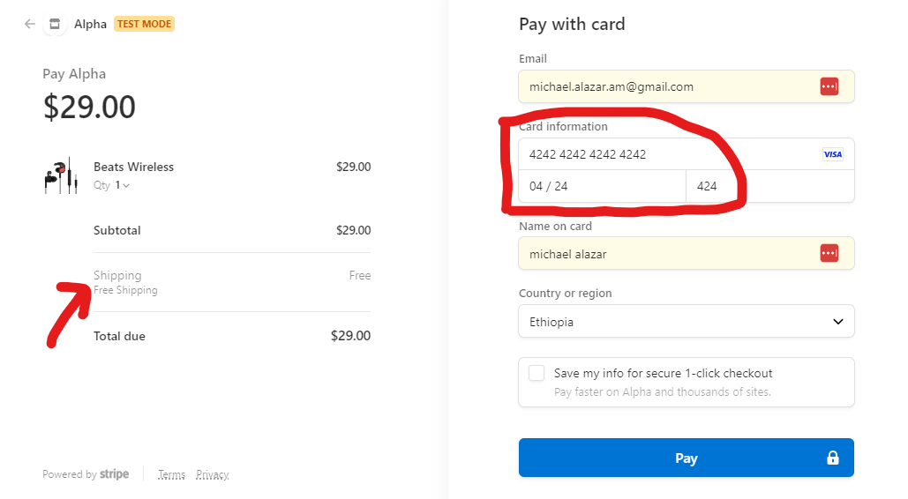
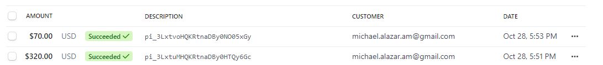
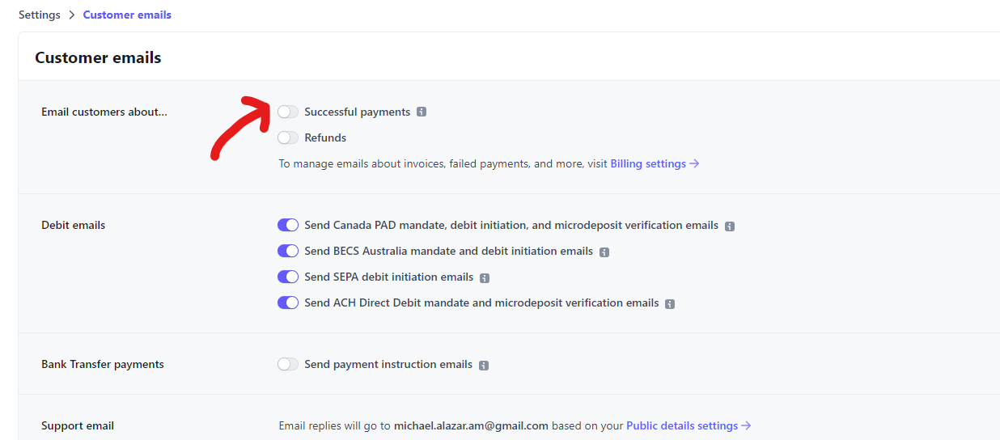

- Go to [Stipe](stripe.com)
- If you don't already have an account create one, if you do login, tun on `Test mode`.
- Make sure to give your account name ([Stripe Account Setting](https://dashboard.stripe.com/settings/account))
- Copy your `Publishable key` and `Secret key`.
- Inside `pages`, there is an `api` folder this folder will not be rendered but it will act as our backend

- Create variables inside `.env` called `STRIPE_PUBLISHABLE_KEY` and `STRIPE_SECRET_KEY` or name them whatever you want and paste your publishable key and secret key to their respective variable




- Copy your shipping rate Id

- Go to `api` folder and create `stipe.js`, and add the following

```
import Stripe from "stripe";

const stripe = new Stripe(process.env.STRIPE_SECRET_KEY);

export default async function handler(req, res) {
  if (req.method === "POST") {
    try {
      const params = {
        submit_type: "pay",
        mode: "payment",
        payment_method_types: ["card"],
        billing_address_collection: "auto",
        // Paste your shipping id inside the quotes.
        shipping_options: [{ shipping_rate: "shr_1LxVIiHQKRtnaDBysVpFzUBy" }],
        line_items: req.body.map((item) => {
          const img = item.image[0].asset._ref;
          const newImage = img
            .replace(
              "image-",
              "https://cdn.sanity.io/images/3gg28b3j/production/"
            )
            .replace("-webp", ".webp");

          return {
            price_data: {
              currency: "usd",
              product_data: {
                name: item.name,
                images: [newImage],
              },
              unit_amount: item.price * 100,
            },
            adjustable_quantity: {
              enabled: true,
              minimum: 1,
            },
            quantity: item.quantity,
          };
        }),
        // leave the success url at root (you can add custom routes)
        success_url: `${req.headers.origin}/success`,
        cancel_url: `${req.headers.origin}/cancel`,
      };

      // Create Checkout Sessions from body params.
      const session = await stripe.checkout.sessions.create(params);

      res.status(200).json(session);
    } catch (err) {
      res.status(err.statusCode || 500).json(err.message);
    }
  } else {
    res.setHeader("Allow", "POST");
    res.status(405).end("Method Not Allowed");
  }
}

```

- Make sure to test your app with different shipping rates and make sure that your currency is the same everywhere

- Handle checkout `cart.jsx` screen shots get stripe env files stipe.js.

- In side `Cart.jsx`, create a function that will handle payment with stripe.

```
  const handleCheckout = async () => {
    const stripe = await getStripe();

    const response = await fetch("/api/stripe", {
      method: "POST",
      headers: {
        "Content-Type": "application/json",
      },
      body: JSON.stringify(cartItems),
    });

    if (response.statusCode === 500) return;

    const data = await response.json();
    console.log(data)

    toast.loading("Redirecting . . . ");

    stripe.redirectToCheckout({ sessionId: data.id });
  };
```

- And your button should accept the function we just created.

```
 <button type="button" className="btn" onClick={handleCheckout}>
    Pay with Stripe
</button>
```

- Inside `lib` folder create `getStripe.js` file.

```
import { loadStripe } from "@stripe/stripe-js";

let stripePromise;

const getStripe = () => {
  if (!stripePromise) {
    stripePromise = loadStripe(process.env.STRIPE_PUBLISHABLE_KEY);
  }

  return stripePromise;
};

export default getStripe;
```

- Import this in to `Cart.jsx,

```
import getStripe from "../lib/getStripe";
```

- Free shipping stripe checkout page
  !!!success
  For card information use  
  4242 4242 4242 4242 (card number)  
  04 / 24 (valid till)  
  424 (CVC number)  
  This are dummy values used for testing
  !!!
  

- Fast shipping with shipping rate.  
  The value we gave for shipping cost will automatically be added
  

- Check out the users that have bought your items.
  
- If you want to email your customers about successful payment.  
  [Your Account page](https://dashboard.stripe.com/settings/emails)
  

## Success page

- Inside pages create a file `success.js`. It will contain these

```
import React, { useState, useEffect } from "react";
import Link from "next/link";
import { BsBagCheckFill } from "react-icons/bs";
import { useStateContext } from "../context/StateContext";
import {runFireworks} "../lib/utils"

const Success = () => {
  // we will be resetting our values thats why we brought them here
  const { setCartItems, setTotalPrice, setTotalQuantities } = useStateContext();
//   as soon as you land on this page everything resets
  useEffect(()=>{
    localStorage.clear()
    setCartItems([])
    setTotalPrice(0)
    setTotalQuantities(0)
    // automatically run the confetti
    runFireworks()

  }, [])

  return (
    <div className="success-wrapper">
      <div className="success">
        <p className="icon">
          <BsBagCheckFill />
        </p>
        <h2> Thank you for your order</h2>
        <p className="email-msg"> Check your email for receipt.</p>
        <p className="description">
          {" "}
          If you got questions, please
          <a className="email" href="mailto:michael.alazar@gmail.com">
            michael.alazar@gmail.com
          </a>
        </p>
        <Link href="/">
            <button type="button" width="300px" className="btn">
                Continue Shopping
            </button>
        </Link>
      </div>
    </div>
  );
};

export default Success;

```

- To create the confetti, we will create a `utils.js` file inside `lib` folder.

```
import confetti from "canvas-confetti";

export const runFireworks = () => {
  var duration = 15 * 1000;
  var animationEnd = Date.now() + duration;
  var defaults = { startVelocity: 30, spread: 360, ticks: 60, zIndex: 0 };

  function randomInRange(min, max) {
    return Math.random() * (max - min) + min;
  }

  var interval = setInterval(function () {
    var timeLeft = animationEnd - Date.now();

    if (timeLeft <= 0) {
      return clearInterval(interval);
    }

    var particleCount = 50 * (timeLeft / duration);
    // since particles fall down, start a bit higher than random
    confetti(
      Object.assign({}, defaults, {
        particleCount,
        origin: { x: randomInRange(0.1, 0.3), y: Math.random() - 0.2 },
      })
    );
    confetti(
      Object.assign({}, defaults, {
        particleCount,
        origin: { x: randomInRange(0.7, 0.9), y: Math.random() - 0.2 },
      })
    );
  }, 250);
};

```

- What about canceled purchases?
- Create `cancel.js` inside `pages` folder

```
import React from "react";
import Link from "next/link";
import { FcCancel } from "react-icons/fc";

const Cancel = () => {
  return (
    <div className="fail-wrapper">
      <div className="cancel">
        <p className="icon"></p>
        <h2> You canceled your order.</h2>
        <p className="icon">
          <FcCancel />
        </p>
        <p className="description">
          {" "}
          If you got questions, please contact us at{" "}
          <a className="email" href="mailto:michael.alazar@gmail.com">
            michael.alazar@gmail.com
          </a>
        </p>
        <Link href="/">
          <button type="button" width="300px" className="btn">
            Continue Shopping
          </button>
        </Link>
      </div>
    </div>
  );
};
export default Cancel;

```
